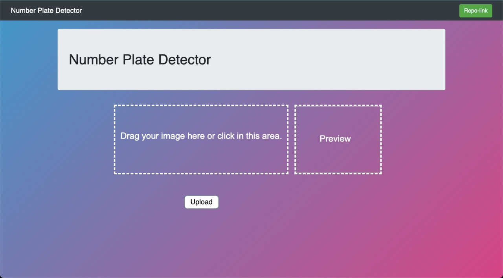
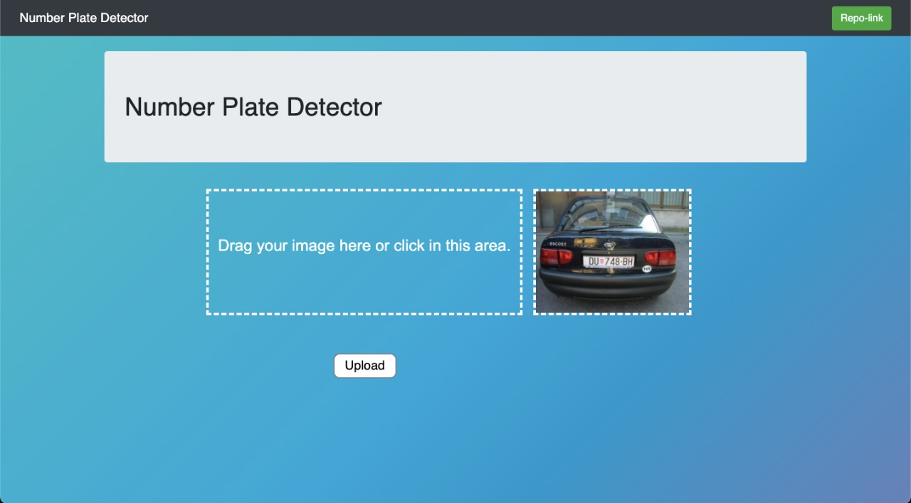
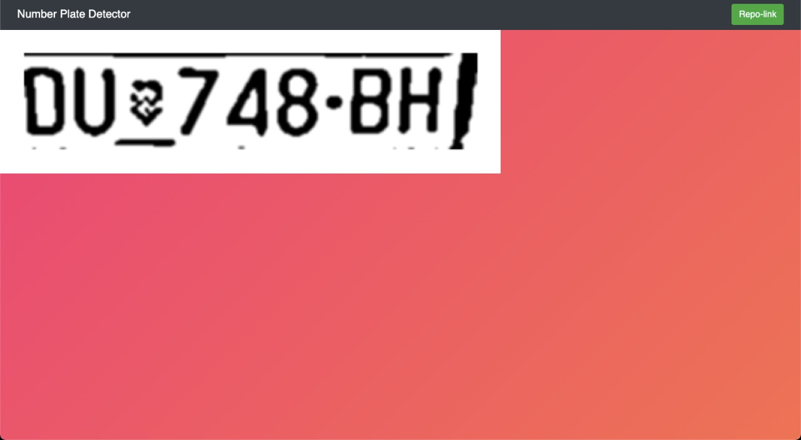

# DevFest-2.0
# Flask and OpenCV based Number Plate Detector

## Description
An application that can take as input images (may be from video cameras) and detects number plate within that image. Our Project may be integrated with traffic cameras to detect law breaking at traffic lights or to accererate toll payment process

## Tech Stack
       

## Project Screenshots

